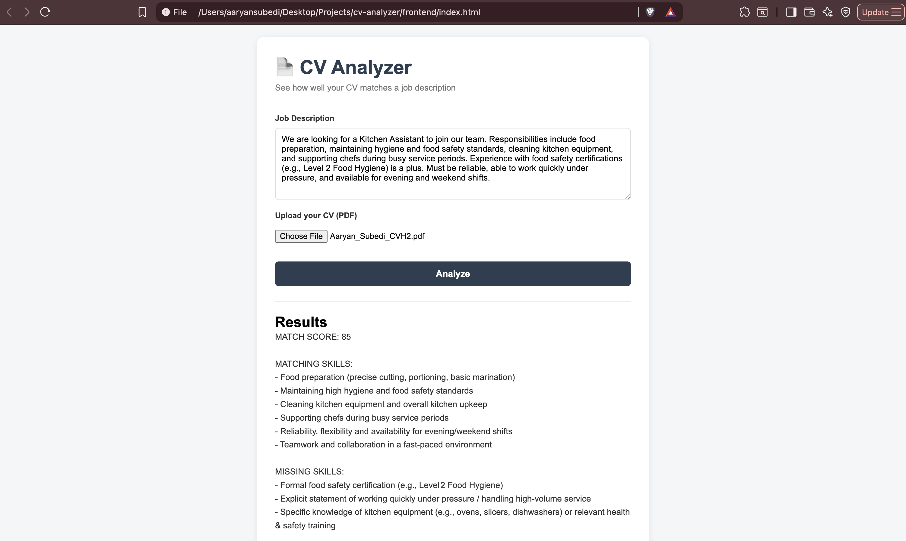
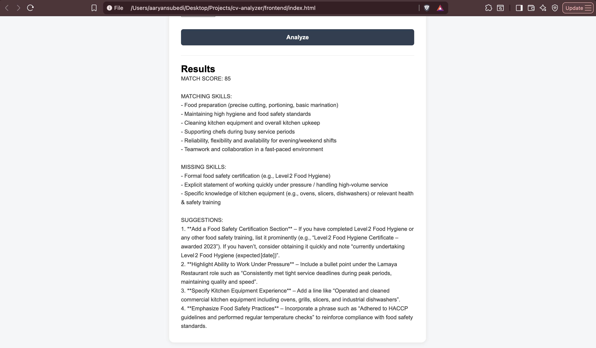

# 📄 CV Analyzer

An AI-powered tool that compares a CV against a job description and provides a match score, identifies matching/missing skills, and gives actionable suggestions to improve the CV.

## Why I built this

I wanted to build something genuinely useful for my own placement applications while also learning how to integrate an LLM into a real application, not just call an API and print the raw response. The interesting part was designing a prompt structure that reliably returns a consistent, parseable format (score, matching skills, missing skills, suggestions) across very different job types.

## Features
- Upload a CV (PDF) and paste a job description
- Extracts text from the PDF automatically
- Uses an LLM (via Groq API) to analyze fit between CV and role
- Returns a match score (0-100), matching skills, missing skills, and specific improvement suggestions

## Tech Stack
**Backend:** Python, FastAPI, Groq API (LLM inference)
**Frontend:** HTML, CSS, JavaScript (vanilla)
**Libraries:** pypdf (PDF text extraction), python-dotenv (secure config)

## Architecture
- FastAPI backend exposes a single `/analyze` endpoint accepting a PDF file and job description text
- PDF text is extracted server-side using `pypdf`
- Extracted text and job description are sent to Groq's LLM API with a structured prompt
- Response is parsed and returned as JSON, then rendered on the frontend

## How to Run

**Backend:**
1. Clone this repo
2. Create a virtual environment: `python3 -m venv venv && source venv/bin/activate`
3. Install dependencies: `pip install -r requirements.txt`
4. Create a `.env` file with your own Groq API key: `GROQ_API_KEY=your_key_here`
5. Run the server: `uvicorn main:app --reload --port 8000`

**Frontend:**
1. Open `frontend/index.html` in your browser
2. Make sure the backend is running first

## Screenshots

### CV and job description input

### Analysis results

## API Endpoint
| Method | Endpoint | Description |
|--------|----------|-------------|
| POST | /analyze | Accepts a CV (PDF) + job description, returns AI-generated analysis |

## Future Improvements
- Support scanned/image-based PDFs via OCR
- Support multiple file formats (Word, plain text)
- Store analysis history per user
- Deploy live with public demo link

---
Built by Aaryan Subedi